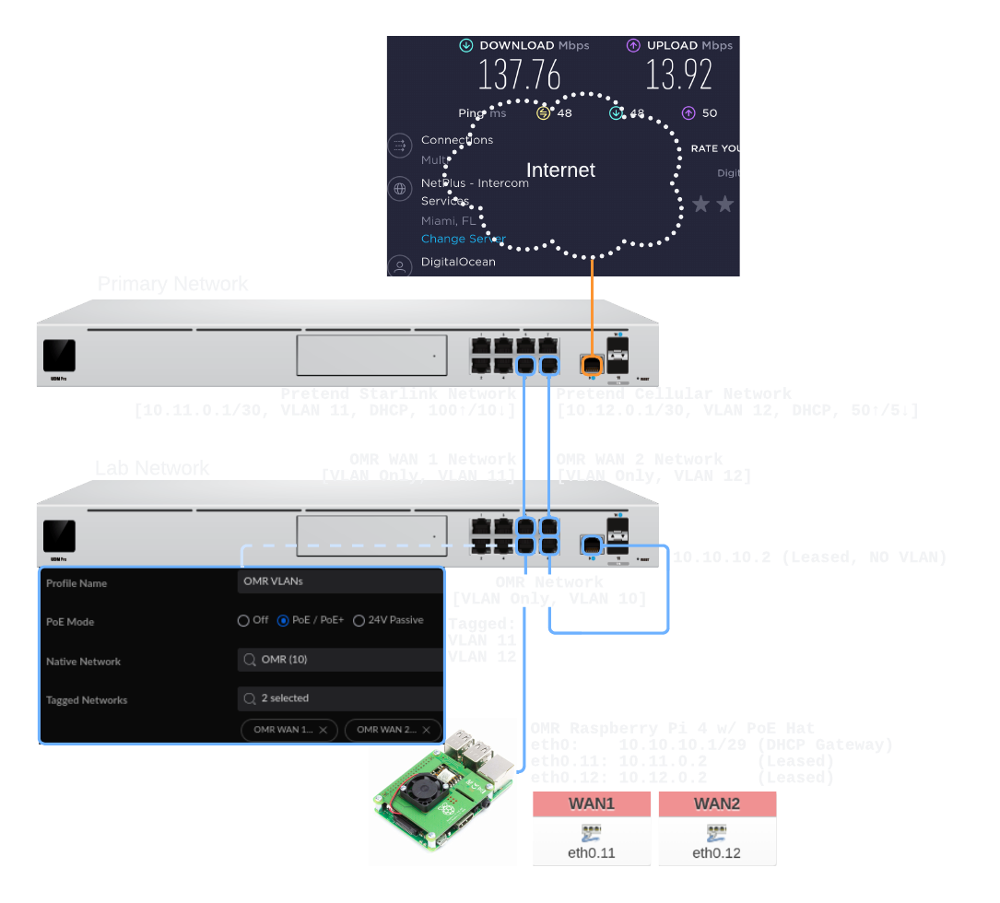

# OpenMPTCProuter VPS [Beta]

This project is used to create an
[OpenMPTCProuter](https://www.openmptcprouter.com/) (OMR) VPS
image. OMR uses [MultiPath TCP](https://www.multipath-tcp.org/)
(MPTCP) and [OpenWrt](https://openwrt.org/) to aggregate multiple
Internet connections. This Droplet serves as the aggregation
endpoint for your local OMR. If you like OMR, consider donating
at: openmptcprouter.com.

Wait Wat? ELI5: OK, so let's say you spend a lot of time in an
area with unreliable and/or slow Internet (🚐 🌲 🏕️). You can't
get a single good Internet connection, but you can get several
so-so options (Starlink, Cellular, Open Hotspots, etc.). OMR
allows you to leverage MPTCP so that you can aggregate or bond
those connections together into a faster, more reliable
connection.

Cool, cool cool cool...so how do I...

## Use It

If you want to get up and running in as little time as possible:

1. Go [here](https://marketplace.digitalocean.com/apps/openmptcprouter), create a Droplet, wait a bit, then SSH in (port 65222)
2. Grab your server key from `/root/openmptcprouter_config.txt` &
   add it along with your Droplet IP to your local OMR (see [OMR
   Homelab Client Setup Guides](#omr-homelab-client-setup-guides))
3. Profit

Slightly more info:

* This image was built using a $4 Droplet, and it should
(🤞) work just fine on one
* First boot setup takes a bit of time
    - Why? On first boot, the OS is updated. Then, OpenMPTCProuter
      is installed.
* The README in the Droplet provides additional info
* Using Floating / Reserved IPs:
    - Create your Droplet
    - Assign your Reserved IP to the Droplet

### OMR Homelab Client Setup Guides

- [OpenMPTCProuter tutorials page](https://github.com/Ysurac/openmptcprouter/wiki/Tutorials)
- [Kamru's guide](https://kamrul.dev/aggregate-multiple-internet-with-openmptcprouter/)

#### UDM Pro SE & Raspberry Pi 4

The image below is the setup I used to test the OMR VPS Image. To
use this setup in the field:
- Remove the Primary UDM Pro SE from the picture
- Connect the OMR WAN 1 port (UDM port 5 in the picture below) to
  your first modem/router, e.g. a Starlink router (preferrably in
  passthrough mode)
- Connect the OMR WAN 2 port (UDM port 7 in the picture below) to
  your second modem/router, e.g. a cellular modem

##### UDM Config

- Create 3 VLAN only networks; in the picture above:
  - OMR is VLAN 10
  - OMR WAN 1 is VLAN 11
  - OMR WAN 2 is VLAN 12
- Create a port profile (OMR VLANs):
  - Native network is OMR (VLAN 10), i.e. untagged
  - Tagged networks are:
    - OMR WAN 1 (VLAN 11)
    - OMR WAN 2 (VLAN 12)
- Assign each network and the port profile:
  - VLAN 10 is on Port 8
  - VLAN 11 is on Port 5
  - VLAN 12 is on Port 7
  - OMR VLANs is on Port 6
- Connect your cables:
  - Modem/router 1 to Port 5
  - Modem/router 2 to Port 7
  - WAN Port 9 to Port 8
  - OMR to Port 6

🤞 I didn't forget anything

##### OMR Config

Kamru has an excellent
[guide](https://kamrul.dev/aggregate-multiple-internet-with-openmptcprouter/)
on this! It's what I used to setup my OMR. A summary below:

- Set a password
  - System > Administration
- **Probably change the LAN subnet as it collides with Starlink**
  - Network > Interfaces > LAN > Edit
  - 10.10.10.0/29 is used in the picture above
- Delete the default WAN ports and create two new ones:
  - Create one on `eth0.11` interface
  - Create another on `eth0.12` interface
  - Set the appropriate protocol for each (DHCP here)
  - Make sure they are added to WAN under Firewall Settings
- Go to: System > OpenMPTCProuter > Settings Wizard
  - Set the Server IP to your OMR VPS
  - Set the Server Key to your OMR VPS Server Key
  - Set ISP1 MultiPath TCP to Master
  - Set IPS2 MultiPath TCP to enabled
  - Verify protocol and interface for both ISP1 & ISP2

🤞 I didn't forget anything

## Contribute Changes

### Create the OpenMPTCProuter Image

First, generate an `API_TOKEN` on the [API
page](https://cloud.digitalocean.com/account/api/tokens). Then,
create a vars file:

    echo 'do_token = "API_TOKEN"' > variables.auto.pkrvars.hcl

Finally, validate and build the image:

    packer init .
    packer validate .
    packer build .

### Provision Droplets for Testing

The recommended way to provision droplets for testing is by using
terraform.

Use Cases:
1. You created an image by following the steps in the [Create the
   OpenMPTCProuter Image](#create-the-openmptcprouter-image)
   section above and you would like to now create a Droplet using
   that image.
2. You want to create a Droplet using the image that the packer
   build is based off of so you can test the build scripts in a
   clean environment.

#### Terraform Configuration

First, we need to create a vars file:

    cd terraform
    echo 'do_token = "API_TOKEN"' > terraform.auto.tfvars
    echo 'image    = "IMAGE_ID"' >> terraform.auto.tfvars
    echo 'ssh_keys = [SSH_ID]'   >> terraform.auto.tfvars

_NB: the square brackets `[]` around `SSH_ID` are required._

Now that we have a template, let's grab the required information:

**API_TOKEN:** use the API_TOKEN that you generated in the [Create
the OpenMPTCProuter Image](#create-the-openmptcprouter-image)
section above.

**IMAGE_ID:** the `IMAGE_ID` you use here depends on the use case
(listed [above](#provision-droplets-for-testing))

1. For use case 1, the `IMAGE_ID` is a string of numbers output by
   the Packer build process.
2. For use case 2, the `IMAGE_ID` is `debian-11-x64`

Alternatively:

* Find the `IMAGE_ID` in the URL (`imageId=` for Snapshots,
  `distroImage=` for Distributions) of the [Create Droplets
  page](https://cloud.digitalocean.com/droplets/new) after
  selecting the desired image in the "Snapshots" tab.
* Acquire the `IMAGE_ID` from the API:

    - Distributions

            curl -s -X GET \
            -H "Content-Type: application/json" \
            -H "Authorization: Bearer API_TOKEN" \
            "https://api.digitalocean.com/v2/images?type=distribution" | \
            jq -r '.images | .[] | [.id, .name] | @tsv'

    - Snapshots

            curl -s -X GET \
            -H "Content-Type: application/json" \
            -H "Authorization: Bearer API_TOKEN" \
            "https://api.digitalocean.com/v2/images?private=true" | \
            jq -r '.images | .[] | [.id, .name] | @tsv'

**SSH_ID:** DO's ID for your SSH public key. You can obtain the
`SSH_ID` for any previously added keys (i.e. any public keys
added via the API or via the [Settings -> Security
page](https://cloud.digitalocean.com/account/security)) with the
following query:

        curl -s -X GET \
        -H "Content-Type: application/json" \
        -H "Authorization: Bearer API_TOKEN" \
        "https://api.digitalocean.com/v2/account/keys" | \
        jq -r '.ssh_keys | .[] | [.name, .id] | @tsv'

If you haven't yet added a key, you can use the query below to
upload your SSH public key and get its `SSH_ID`:

      curl -X POST \
      -H "Content-Type: application/json" \
      -H "Authorization: Bearer API_TOKEN" \
      -d "{\"name\":\"OMR Key\",\"public_key\":\"$(cat ~/.ssh/id_rsa.pub)\"}" \
      "https://api.digitalocean.com/v2/account/keys"

#### Terraform Use

If you don't already have Terraform installed, checkout
Terraform's [installation page
](https://learn.hashicorp.com/tutorials/terraform/install-cli).
The terraform code requires version 1.2.0 or later.

Make sure you've setup your vars file as described in the previous
section. Then:

    terraform init
    terraform validate
    terraform plan
    terraform apply

You may use `terraform show` to see your Droplet's IP address:

    terraform show

Finally, to destroy your Droplet:

    terraform destroy
